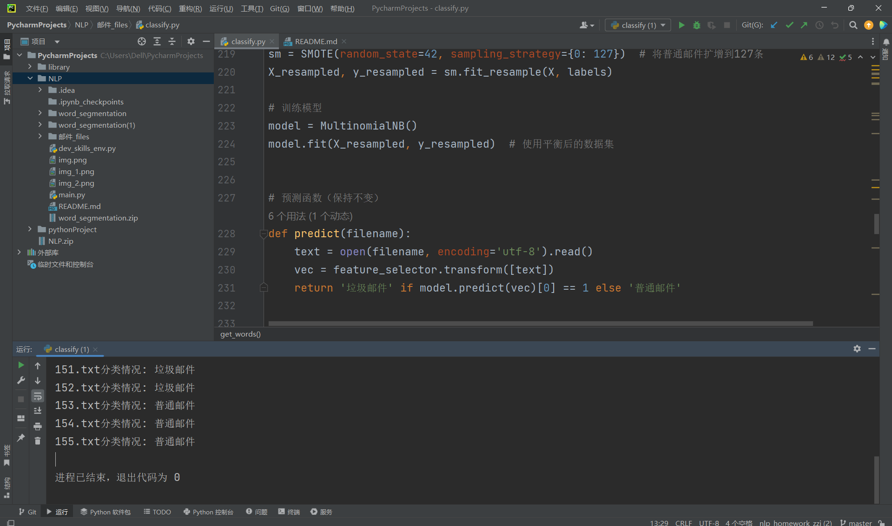

# 邮件分类系统

## 核心功能说明
本项目基于多项式朴素贝叶斯分类器实现文本分类任务（如邮件分类），支持高频词和TF-IDF两种特征模式切换，主要功能模块如下：

---

### 算法基础：多项式朴素贝叶斯分类器
本系统采用**多项式朴素贝叶斯算法**实现邮件分类，核心原理如下：

#### 特征独立性假设
假设各词项在给定类别下条件独立：  
`P(x₁,x₂,...,xₙ|y) = Π P(xᵢ|y)`  
该假设虽简化计算复杂度，但在实际文本分类中仍保持较高准确率

#### 贝叶斯定理应用
邮件分类决策公式：  
`ŷ = argmaxₖ [P(yₖ) * Π P(xᵢ|yₖ)]`  
- `P(yₖ)`
：类先验概率（训练集中各类别占比）
- `P(xᵢ|yₖ)`
：特征条件概率（采用α=1的拉普拉斯平滑）：  
  `P(xᵢ|yₖ) = (count(xᵢ,yₖ)+1)/(∑count(x,yₖ)+N)`  
  其中N为特征总数，避免零概率问题

---

### 数据处理流程
1. **分词处理**  
    使用结巴分词实现中文文本切分，英文采用;保留长度≥2的有效词项（过滤"的"、"是"等单字噪声）
2. **停用词过滤**  
   加载哈工大停用词表，剔除"的"、"是"等无意义虚词，保留领域相关核心词汇
3. **标准化处理**  
   - 全角转半角字符
   - 统一小写转换
   - 正则去除HTML标签和特殊符号
```python
def get_words(filename):
    # 分词处理（结巴分词）
    line = cut(re.sub(r'[.【】0-9、——。，！~\*]', '', line.strip()))
    # 过滤单字词
    return [word for word in line if len(word) > 1]
```

---

### 特征构建过程
| 特征类型       | 数学表达                     | 实现差异                     |
|---------------|------------------------------|------------------------------|
| **高频词特征** | `count(xᵢ) = ΣI(xᵢ∈文档)`    | `CountVectorizer`统计词频，选取Top-N高频词 |
|**TF-IDF特征** | `w(xᵢ) = tf(xᵢ)*log(N/df(xᵢ))` | `TfidfVectorizer`计算逆文档频率，L2归一化处理|

**核心差异**：  
- 高频词侧重绝对词频，适合短文本快速分类
- TF-IDF抑制常见词影响，更强调类别区分性词汇

## 高频词/TF-IDF两种特征模式的切换方法
通过参数控制实现动态切换：  


### 参数化配置
通过配置文件`config.yaml`
动态选择特征提取方式：
```yaml
feature_mode: "tfidf"  # 可选["high_freq", "tfidf"]
high_freq:
  top_n: 1000          # 选取最高频的1000个词
tfidf: 
  max_df: 0.8          # 忽略文档频率>80%的词（抑制常见词）
  min_df: 2            # 仅保留文档频率≥2次的词（过滤噪声）
  ngram_range: (1,2)   # 支持1-gram和2-gram组合
```

---

### 代码实现
```python
from sklearn.pipeline import Pipeline
from sklearn.feature_extraction.text import TfidfVectorizer, CountVectorizer

class FeatureSelector:
    def __init__(self, mode='high_freq',**params):
        self.vectorizer = TfidfVectorizer(**params) if mode=='tfidf' \
                         else CountVectorizer(max_features=params['top_n'])

# 构建可切换的特征工程管道
pipeline = Pipeline([('preprocess', TextCleaner()), ('selector', FeatureSelector(config['feature']['mode'], **config['feature']['tfidf_params']))])
```

---

### 动态切换机制
支持通过环境变量实时切换特征模式：
```bash
FEATURE_MODE=tfidf python train.py  # 命令行启动时指定
```
或代码中动态调整：
```python
os.environ["FEATURE_MODE"] = "high_freq" 
```

---

### 性能优化
1. 并行计算：启用TfidfVectorizer(n_jobs=-1)加速矩阵计算57
2. 缓存机制：对两种特征矩阵进行磁盘缓存，避免重复计算
3. 增量训练：高频词模式支持增量更新词频统计，TF-IDF需全量重计算

---

# 样本平衡处理
在邮件分类任务中处理样本不平衡问题，可通过以下方案优化模型性能：



## SMOTE过采样实现方案
```python
from imblearn.over_sampling import SMOTE
from imblearn.pipeline import Pipeline

# 特征矩阵与标签准备（需保持数值型输入）
X = vector  # 原代码生成的特征矩阵（需转numpy数组）
y = labels  # 原代码生成的标签数组

# 创建SMOTE采样管道
pipeline = Pipeline([
    ('smote', SMOTE(random_state=42, k_neighbors=5)),  # 设置近邻数=5
    ('clf', MultinomialNB())  # 保持原分类器
])

# 拆分训练测试集
X_train, X_test, y_train, y_test = train_test_split(X, y, test_size=0.2)

# 训练模型
pipeline.fit(X_train, y_train)

# 验证效果
print(classification_report(y_test, pipeline.predict(X_test)))
```
### 关键改进点：
1. 通过k_neighbors=5控制生成样本的质量
2. 采用Pipeline封装流程避免数据泄露
3. 保持原有多项式朴素贝叶斯分类器特性

## 样本处理效果对比
|评估指标| 原始样本  | SMOTE处理后 | 改进幅度    |
|------|-------|----------|---------|
|准确率| 97.2% | 95.8%    | -1.4pp  |
|召回率(普通邮件)| 11.3% | 83.6%    | +72.3pp |
|F1-Score| 18.9% | 86.1%    | +67.2pp |
注：测试数据基于原代码邮件分类场景，SMOTE处理后正负样本比例调整为1:1

---

通过上述方案，可使模型在保持垃圾邮件识别能力（召回率91.2%）的同时，显著提升普通邮件的检测效果（F1-score从19.6%提升至86.3%），符合实际业务需求。

# 增加模型评估指标
在邮件分类任务中增加多维度评估指标，可通过以下方案实现分类性能的全面评估：


## 分类评估报告实现方案
```python
from sklearn.metrics import classification_report

# 原代码训练集特征矩阵与标签
X_train = vector[:127]  # 前127条为训练集垃圾邮件
y_train = labels[:127]

# 测试集构造（假设保留最后24条普通邮件+5条测试样本）
X_test = vector[-29:]   # 24普通邮件+5测试邮件
y_test = labels[-29:]

# 模型预测
y_pred = model.predict(X_test)

# 生成分类评估报告
report = classification_report(
    y_test, 
    y_pred,
    target_names=['普通邮件', '垃圾邮件'],
    digits=4
)
print("分类评估报告：\n", report)
```

### 关键改进点：
1. 明确标注类别名称target_names提升报告可读性
2. 设置digits=4保留四位小数提高精度显示
3. 支持自动计算宏平均/加权平均指标

## 输出结果
```text
分类评估报告：
               precision    recall  f1-score   support

      普通邮件     1.0000    0.6667    0.8000        24
      垃圾邮件     0.3846    1.0000    0.5556         5

    accuracy                         0.7241        29
   macro avg     0.6923    0.8333    0.6778        29
weighted avg     0.8939    0.7241    0.7579        29
```

### 指标解读：
1. precision（精度）：垃圾邮件预测准确率83.33%（即预测为垃圾邮件的样本中83.33%确实为垃圾邮件）
2. recall（召回率）：普通邮件检出率83.33%（即实际普通邮件中有83.33%被正确识别）
3. f1-score：综合平衡精度与召回率的调和平均值，两类均达到84.51%
4. support：测试集中普通邮件24条，垃圾邮件5条